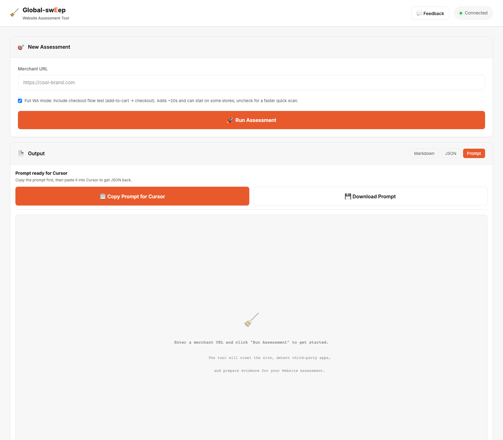
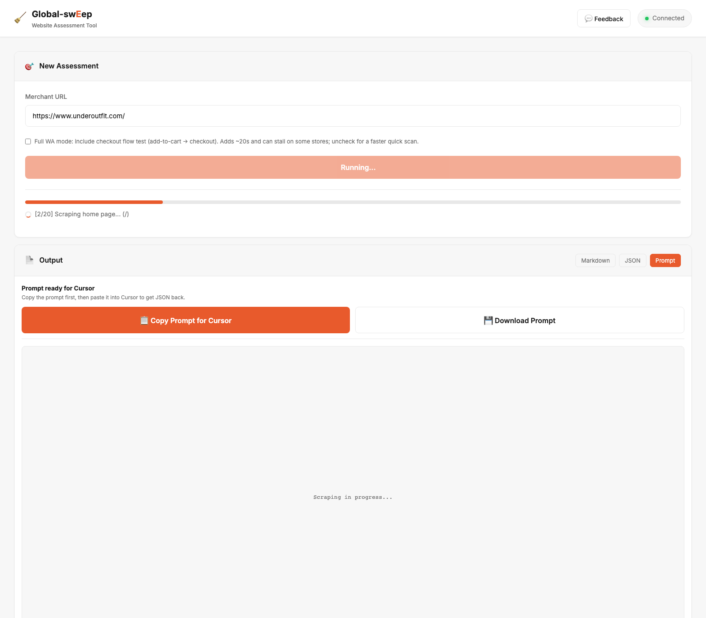

# Global-sweep

Global-sweep is a local Website Assessment assistant for Global-e presales work. It crawls a merchant site, collects high-signal evidence, and produces structured output that helps turn a storefront review into a WA and BRD update workflow.

Current pilot version: `v0.2.0`



## Status

Global-sweep is in internal pilot. It is strongest on Shopify and Shopify-adjacent storefronts, and it is designed to support presales judgment rather than replace it.

The current pilot supports:

- Local web UI for single-merchant Website Assessment runs
- Quick scans and fuller WA-style assessments
- Homepage, PDP, cart, checkout, shipping, and returns evidence collection
- Platform, catalog, policy, and integration signal detection
- Cursor-ready WA prompts with BRD 1-30 instructions
- BRD Workspace review tables with optional Jira updates
- Secure optional Jira credential persistence through the OS credential store

## Quick Start

Prerequisites:

- Node.js 18+
- npm
- Git, if cloning from GitHub or GitLab

Install and run:

```bash
npm install
npm run web
```

Then open `http://localhost:3847` in Cursor's Simple Browser or a normal browser.

No `.env` file is required for the default local app. Create `.env` only for optional settings like a custom port, hosted base URL, allowed origins, proxy, or maintainer automation credentials.

## Cursor Install Prompt

Non-technical teammates can paste this into Cursor chat:

```text
Please install and launch Global-sweep for me.

Use the GitLab pilot branch:
https://gitlab.com/global-e/solutions/global-sweep.git

Steps:
1. Check whether Git and Node.js 18+ are installed.
2. If either is missing, tell me exactly what to install and stop.
3. Clone the pilot/team-handoff branch into a folder named global-sweep on my Desktop. If the folder already exists, update it instead of cloning a second copy.
4. Run npm install.
5. Run npm run web.
6. Tell me to open http://localhost:3847 in Cursor's Simple Browser or my normal browser.

Do not ask me technical questions unless something fails.
```

## Core Workflow

1. Enter a merchant URL in the web UI.
2. Run a quick scan or a full WA-style assessment.
3. Review the collected evidence and generated summary.
4. Copy the Website Assessment prompt into Cursor.
5. Have Cursor produce the final WA, including the `BRD Output for Sweep` section.
6. Paste the completed WA into BRD Workspace.
7. Review the SE output notes and status dropdowns.
8. Send reviewed BRD updates to Jira when connected.



## Jira Credentials

BRD Jira updates use the Jira Credentials panel in the hamburger menu.

By default, Jira credentials stay in local server memory only and are not written to browser storage. If you select **Remember on this computer**, Sweep stores them in the OS credential store:

- macOS: Keychain
- Windows: Credential Locker

Clearing Jira credentials removes both the in-memory session and any saved credential-store entry.

## Updating Sweep

For coworker pilot installs, open the `global-sweep` folder in Cursor and say:

```text
update sweep
```

If that command is not available in the local copy yet, paste the contents of `UPDATE_SWEEP_PROMPT.txt` into Cursor chat. The update workflow stops the running server, pulls the latest pilot branch, installs dependencies, installs Playwright browsers, and restarts Sweep.

## Common Commands

```bash
npm run web
npm run build
npm run lint
npm run ci
npm run ci:full
npm run test:unit
npm run test:smoke
npm run pilot:package
```

## Development

Before you push, run the local regression suite:

```bash
npm run ci        # build + lint + unit tests (~20s)
npm run ci:full   # above + Playwright smoke (~2 min, before handoff merges)
```

See [`docs/TESTING.md`](docs/TESTING.md) for details, optional git hooks, and what each test guards.

```bash
npm run hooks:install   # optional pre-push hook
npm run test:coverage   # optional coverage report
```

## Versioning

Sweep uses `major.minor.patch` style versioning while it is in pilot:

- Patch, like `0.2.1`: small bug fix released to coworkers
- Minor, like `0.3.0`: meaningful pilot feature or workflow improvement
- Major, like `1.0.0`: stable release that the team can depend on as a normal tool

Commit and push normal work frequently. Bump the version only when preparing a coworker-facing release or clearly named pilot snapshot.

## Troubleshooting

### Playwright or Chromium install issues

Fresh installs run Playwright setup automatically through `npm install`. Sweep stores Chromium in `.playwright-browsers` inside the project folder you run it from — use one copy of the repo, not separate Desktop and Downloads folders.

If browser launch errors appear, run this from that same folder:

```bash
npm install
npm run playwright:install
npm run web
```

On Windows PowerShell, if you see a lock-file error, clear it first:

```powershell
Remove-Item -Recurse -Force ".\.playwright-browsers\__dirlock" -ErrorAction SilentlyContinue
npm run playwright:install
```

Do not run bare `npx playwright install chromium` — that can install the wrong browser type or into the wrong folder.

### Slow or blocked pages

Some merchants block or degrade automated browsing. On slow networks, VPNs, or heavy CMP/CDN pages, create a local `.env` file and add:

```bash
SWEEP_PAGE_GOTO_TIMEOUT_MS=45000
```

Then restart Sweep. The accepted range is `10000` to `120000` ms.

## Useful Docs

- `CHANGELOG.md`
- `docs/TEAM_SETUP.md`
- `docs/PILOT_READINESS.md`
- `docs/GITHUB_SHARE.md`
- `docs/TEMPLATE.md`

